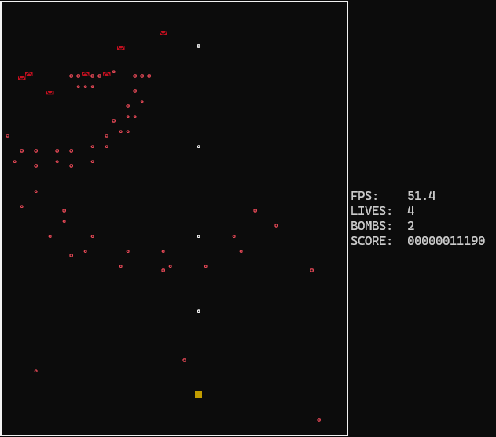

# Projects

## Programming 1 - Console Game Project

This C# project was made for an assignment in Programming I. It is an action-packed game that utilises concepts out of the scope of the course along with a moderate usage of mathematics to manipulate vectors in order to allow for relatively balanced gameplay.

| Technologies Used                     | Use case                                                               |
| ------------------------------------- | ---------------------------------------------------------------------- |
| Object Oriented Programming (Classes) | Storing multiple variables and methods such as for vectors or entities |
| Dynamic Arrays (List)                 | Managing creation and deletion of entities                             |

### Code snippets

```c#
public Vec2(float x, float y) {
    m_x = x;
    m_y = y;
}

private float m_x;
private float m_y;

// Access functions
public float x() { return m_x; }
public float y() { return m_y; }
public void setX<T>(T x) { m_x = Convert.ToSingle(x); }
public void setY<T>(T y) { m_y = Convert.ToSingle(y); }
// Get truncated values, used for drawing
public int pixelX() { return (int)m_x; }
public int pixelY() { return (int)m_y; }
```

```c#
        private List<ConsoleKey> m_movementBuffer = new List<ConsoleKey>();

        // ...

        public void addInputToBuffer(ConsoleKey input)
        {
            if (input != Global.INPUT_DASH)
            {
                m_lastDirection = input;
                m_lastDirectionExpiry.startNew(.5f);
            }
            m_movementBuffer.Add(input);
        }
        public void clearInputBuffer()
        {
            m_movementBuffer.Clear();
        }
```

### Screenshots


### What I Learned

I learned that trying to learn programming concepts that haven't been taught in class is unsurprisingly inefficient. The program experiences frequent slowdowns on the average computer, and, although no "glitches" have been experienced, I am unable to judge whether the implentations are orthodox or not. Furthermore, there is a theoretical possibility in which the program crashes due to the way some mathematical formulas have been handled.

## Programming 2 - Sudoku

This C# project was made $for an assignment in Programming II. It is a console application that runs Sudoku. The code that generates the board was partially written by the professor.

| Technologies Used        | Use case                          |
| ------------------------ | --------------------------------- |
| Multi-dimensional Arrays | Representing the game board       |
| Random Class             | Randomly selecting tiles to erase |

### Code snippets

```c#

    static bool[,] ClearCellsInBoard(TileValue[,] board)
    {
        int totalLength = board.Length;
        int length = board.GetLength(0);

        int numbersToClear = totalLength / 2;

        int[] availableIndeces = new int[totalLength];
        for (int i = 0; i < totalLength; ++i)
        {
            availableIndeces[i] = i;
        }

        for (int i = 0; i < numbersToClear; ++i)
        {
            int randomNumber = random.Next(0, totalLength - i);
            int row = availableIndeces[randomNumber] / length;
            int column = availableIndeces[randomNumber] % length;
            board[row, column] = 0;
            reorderAvailableIndeces(availableIndeces, randomNumber);
        }

        return getLockedCells(length, totalLength, numbersToClear, availableIndeces);
    }
```

```c#
    static bool[,] getLockedCells(int length, int totalLength, int numbersToClear, int[] availableIndeces)
    {
        bool[,] lockedCells = new bool[length, length];
        for (int i = 0; i < totalLength - numbersToClear; ++i)
        {
            int row = availableIndeces[i] / length;
            int column = availableIndeces[i] % length;
            lockedCells[row, column] = true;
        }
        return lockedCells;
    }
```

### Screenshots




### What I Learned

My ability to make functions smaller has improved during the project, as it was a requirement. For instance The previous project had way too many lines per function, whereas this one generally has less than 15 lines per function.
